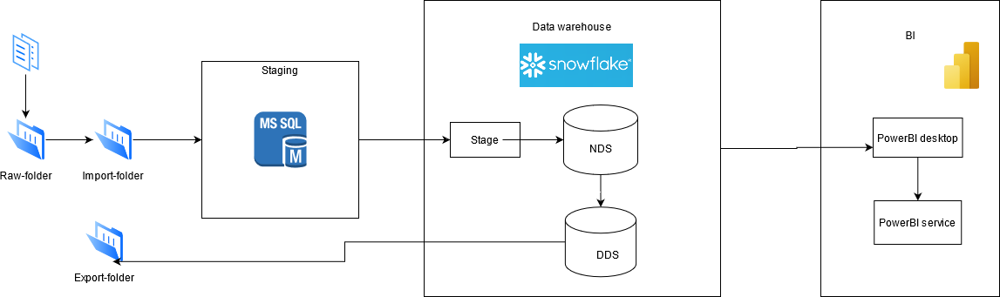
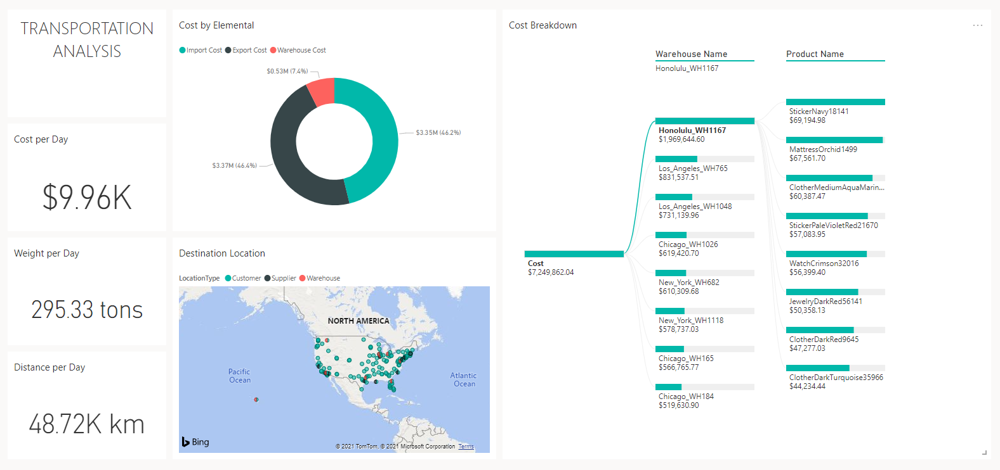

# FA_project2
## Project Topic
### Logistics
Minimizing transportation costs and warehouse allocation.

## Description of this project
This project is using for demo to FA about how to initialize a project and draft data pipeline.

## Purpose
Building the data pipeline

## Detail of Work
1. Design data pipeline [here](./docs/design.png "Architecture")
2. Ingest data from flat file
3. Extract, captured new and changed data
4. Load new and changed data onto Snowflake
5. Normalize and Denormalize data
6. Build data model
7. Visualize data

## How to setup
1. [Download](https://sfc-repo.snowflakecomputing.com/snowsql/index.html) and install snowsql CLI.
2. [Download](https://sfc-repo.snowflakecomputing.com/odbc/index.html) and install ODBC driver. You should install and setup both versions for safety reason. After installation, go to ODBC Data Source on your local computer to setup new System DSN:  
    i. Click Add, select **SnowflakeDSIIDriver**.  
    ii. On **Snowflake Configuration Dialog** enter: 
            - Data Source: Your connection name - Remember it for later use. 
            - User: Your Snowflake username 
            - Password: Your Snowflake password 
            - Server: Your Snowflake server(account) 
            - Database: Your Snowflake initial database 
            - Schema: Your Snowflake initial schema 
            - Warehouse: Your Snowflake initial warehouse 
            - Role: Your Snowflake initial role 
            - Others: Leave it blank 
3. Generate data with: **python RawData.py**.
4. Deploy **Project2.sln** on SQL Server: 
    i. Open **Project2.ispac** under **src\SSIS\bin\Development**. 
    ii. Under **"Select Source"** follow the default Project Deployment, with the path pointing to the **"Project2.ispac"** package. 
    iii. Under **"Select Destination"** enter the name of the server that hosts the SSIS catalog. 
    iv. Select a path under the SSIS catalog, create or use folder **"Project2"**. 
    v. Finalize the wizard by clicking Deploy. 
5. Login into MSSQL, open script [init_mssql.sql](./src/MSSQL/init_mssql.sql), change some variables and run it set up local database, environments, jobs and schedules, you can also change schedule time and frequency as needed. Variables to change:  
    i. var_email: Email for receive Error Alert  
    ii. var_path: Your project path  
    iii. var_snowflake_dsn_name: Your snowflake DSN connection name  
    iv. var_snowflake_account: Your snowflake account  
    v. var_snowflake_password: Your snowflake password  
    vi. var_snowflake_user: Your snowflake username  
6. Login into [Snowflake]((https://fk36375.ap-southeast-1.snowflakecomputing.com/) with suitable user and role, open and run script [init_snowflake.sql](./src/Snowflake/init_snowflake.sql) to set up Snowflake database, data warehouses, stored procedures, streams and tasks.
7. Open **PowerBI**, click Get Data, search for Snowflake.
8. Connect to Snowflake server using your snowflake account.
9. Create PowerBI dashboard. 

## Snowflake trainer account
[Snowflake link](https://fk36375.ap-southeast-1.snowflakecomputing.com/)
1. User: `longbv1`               Password: `abc123`
2. User: `mainq2`                Password: `abc123`
